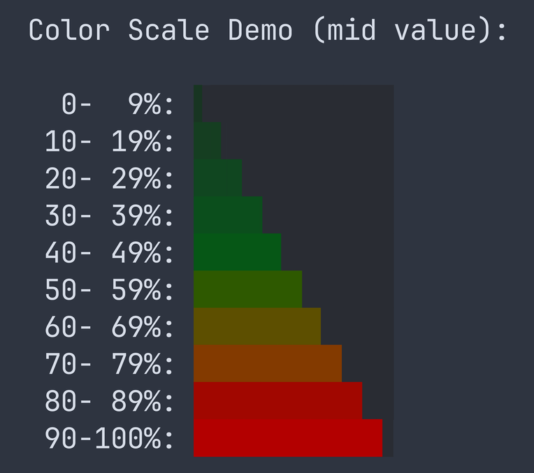

# Claude Code Status Line

A statusline script for [Claude Code](https://docs.anthropic.com/en/docs/claude-code) CLI that displays context window usage, model info, budget tracking, and git status.

### Dark theme


### Light theme


### Vertical gauge style


### Progress bar gradient


### Usage gauges


## Features

- **Model badge** (Opus/Sonnet/Haiku)
- **Context window progress bar and token count with percentage**
- **Working directory**
- **Git branch** (hiding main/master as an option)
- **Usage** tracking both 5-hour and 7-day window showing what needs to be known (how much, to when and how much you’re burning through them)
- **Dark and light theme** support (Nord-inspired palette) with option to customize.
- **Truecolor (24-bit)** with automatic 256-color fallback
- **Customization of what is shown and how**

## Installation

1. Save the script to `~/.claude/claude-code-status-line.py`:

```bash
curl -o ~/.claude/claude-code-status-line.py https://raw.githubusercontent.com/benabraham/claude-code-status-line/main/claude-code-status-line.py
chmod +x ~/.claude/claude-code-status-line.py
```

2. Add to `~/.claude/settings.json`:

```json
{
  "statusLine": {
    "type": "command",
    "command": "~/.claude/claude-code-status-line.py"
  }
}
```

3. Restart Claude Code. After initial setup, edits to the script take effect immediately.

## Configuration

All settings can be configured via environment variables with the `SL_` prefix, without modifying the script. Set them in the `command` field:

```json
{
  "statusLine": {
    "type": "command",
    "command": "SL_THEME=light SL_HIDE_DEFAULT_BRANCH=0 ~/.claude/claude-code-status-line.py"
  }
}
```

Alternatively, edit the defaults at the top of the script.

Boolean values accept `1`/`true`/`yes`/`on` (truthy) or `0`/`false`/`no`/`off` (falsy).

| Env variable | Default | Description |
|---|---|---|
| `SL_SESSION_PROGRESS_BAR_WIDTH` | `12` | Progress bar width in characters |
| `SL_THEME` | `dark` | Color theme: `dark` or `light` |
| `SL_USAGE_LEFT_GAUGE_STYLE` | `blocks` | Usage gauge style: `vertical`, `blocks`, or `none` |
| `SL_USAGE_LEFT_BLOCK_GAUGE_WIDTH` | `4` | Blocks gauge width in characters (2, 4, 8, or 16) |
| `SL_USAGE_CACHE_DURATION` | `300` | Usage API cache duration in seconds |
| `SL_THEME_FILE` | `~/.claude/claude-code-theme.py` | Path to custom theme file (see below) |

### Visibility Toggles

Each part of the status line can be shown or hidden:

| Env variable | Default | Description |
|---|---|---|
| `SL_SHOW_MODEL_NAME` | `1` | Model badge (Opus/Sonnet/Haiku) |
| `SL_SHOW_SESSION_PROGRESS_BAR` | `1` | Context window progress bar |
| `SL_SHOW_SESSION_PERCENTAGE` | `1` | Context usage percentage |
| `SL_SHOW_SESSION_TOKENS` | `1` | Token count (e.g. `84k/200k`) |
| `SL_SHOW_CURRENT_DIR` | `1` | Working directory path |
| `SL_SHOW_GIT_BRANCH` | `1` | Git branch indicator |
| `SL_HIDE_DEFAULT_BRANCH` | `1` | Hide branch when on `main`/`master` |
| `SL_SHOW_5H_USAGE_LEFT` | `1` | 5-hour session usage gauge |
| `SL_SHOW_WEEKLY_USAGE_LEFT` | `1` | 7-day weekly usage gauge |
| `SL_SHOW_FALLBACK_INFO` | `1` | Show fallback values when they differ from API (see below) |

### Fallback Info

The script gets context usage from the Claude Code API (`used_percentage`). It also calculates token counts from the conversation transcript as a fallback. When `SHOW_FALLBACK_INFO` is enabled and these two values differ by more than 10%, the fallback value is shown in red curly braces (e.g. `{84k}` or `{42 %}`). This helps spot cases where the API percentage may be inaccurate.

**Note:** The context window size reported by Claude Code may not always reflect the actual context available. There are known bugs in Claude Code where the reported `used_percentage` or token counts can be inaccurate. The fallback comparison helps detect these discrepancies.

### Custom Themes

Create `~/.claude/claude-code-theme.py` (or set `SL_THEME_FILE` to a custom path) to override any colors without modifying the script. Define only the colors you want to change — everything else inherits from the base theme (`dark` or `light`).

Use hex colors only. The 256-color terminal fallbacks are computed automatically.

```python
# ~/.claude/claude-code-theme.py
# Dracula-inspired custom theme

# Model badges (bg, fg)
model_sonnet = "#50FA7B", "#282A36"
model_opus   = "#BD93F9", "#282A36"
model_haiku  = "#6272A4", "#F8F8F2"

# Progress bar empty fill
bar_empty = "#44475A"

# Text colors
text_cwd = "#FF79C6"
text_git = "#8BE9FD"

# Usage gauge colors
usage_green  = "#50FA7B"
usage_yellow = "#F1FA8C"
usage_red    = "#FF5555"

# Progress bar gradient (threshold, hex)
gradient = [
    (10,  "#1A3A1A"),
    (20,  "#1F4F1A"),
    (30,  "#256419"),
    (40,  "#2E7918"),
    (50,  "#3A8F17"),
    (60,  "#6A8F00"),
    (70,  "#8F7A00"),
    (80,  "#B45A00"),
    (90,  "#D43A00"),
    (101, "#FF5555"),
]
```

#### Available color keys

| Key | Format | Description |
|---|---|---|
| `model_sonnet` | `"#bg", "#fg"` | Sonnet model badge |
| `model_opus` | `"#bg", "#fg"` | Opus model badge |
| `model_haiku` | `"#bg", "#fg"` | Haiku model badge |
| `model_default` | `"#bg", "#fg"` | Fallback model badge |
| `bar_empty` | `"#hex"` | Empty portion of progress bar |
| `text_percent` | `"#hex"` | Percentage text |
| `text_numbers` | `"#hex"` | Token count text |
| `text_cwd` | `"#hex"` | Working directory text |
| `text_git` | `"#hex"` | Git branch text |
| `text_na` | `"#hex"` | N/A indicator text |
| `usage_light` | `"#hex"` | Usage gauge: well ahead |
| `usage_green` | `"#hex"` | Usage gauge: on track |
| `usage_yellow` | `"#hex"` | Usage gauge: faster than sustainable |
| `usage_red` | `"#hex"` | Usage gauge: will run out |
| `gradient` | `[(threshold, "#hex"), ...]` | Progress bar color stops (10 entries, thresholds ending at 101) |

## Demo Modes

Preview the progress bar color gradient:

```bash
# Animated sweep through 0-100%
./claude-code-status-line.py --show-scale

# Static views
./claude-code-status-line.py --show-scale min   # minimum value per range
./claude-code-status-line.py --show-scale mid   # midpoint value per range
./claude-code-status-line.py --show-scale max   # maximum value per range
```

Preview usage indicator scenarios:

```bash
./claude-code-status-line.py --test-usage
```

## How It Works

The script receives JSON on stdin from Claude Code with context window and model information. It renders a single-line status bar:

- The **progress bar** color shifts from green → yellow → orange → red as context fills up
- Colors are theme-aware with both truecolor and 256-color terminal support

### Usage Gauge: Forward-Looking Ratio

The usage gauge doesn't just show how much you've used — it shows whether your current pace is sustainable until the limit resets. It compares what's left of your budget to what's left of the time window:

**ratio = remaining budget / remaining time**

For example, with a 5-hour session limit:

| Scenario | Budget left | Time left | Ratio | Color |
|---|---|---|---|---|
| 1h in, used 20% | 80% | 80% | 1.0 | Green — on track |
| 2h in, used 15% | 85% | 60% | 1.4 | Light — well ahead |
| 2h in, used 50% | 50% | 60% | 0.8 | Yellow — using faster than sustainable |
| 2h in, used 80% | 20% | 60% | 0.3 | Red — will run out before reset |

The same logic applies to the 7-day weekly limit. This means 50% usage isn't alarming if you're 50% through the window, but it is if you're only 20% through.

Color thresholds: **≥ 1.33** light (well ahead) · **≥ 1.0** green (on track) · **≥ 0.75** yellow (faster than sustainable) · **< 0.75** red (will run out).

**5-hour safety override:** Regardless of ratio, the 5-hour gauge forces red when ≤ 5% budget remains, and orange when ≤ 10% remains. This catches cases where the ratio looks fine but you're about to hit the limit.

### Truecolor Detection

The script checks the `COLORTERM` environment variable for `truecolor` or `24bit`. If present, it uses 24-bit RGB colors. Otherwise, it falls back to 256-color mode using the fallback values defined in the theme.

## Contributing

This is a personal tool that I built for my own workflow. You're welcome to fork it and adapt it to your needs.

If you'd like to contribute back, please open an issue first to discuss the change before submitting a pull request.

## License

[MIT](LICENSE)
