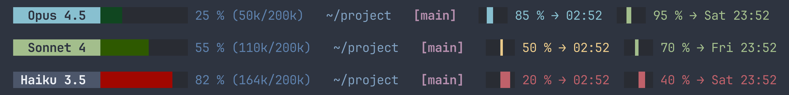
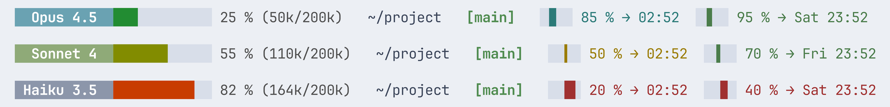
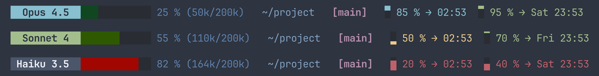
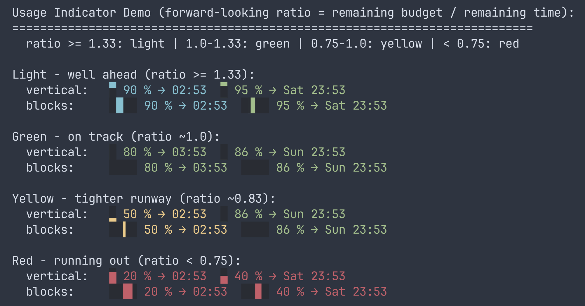

# Claude Code Status Line

A statusline script for [Claude Code](https://docs.anthropic.com/en/docs/claude-code) CLI that displays context window usage, 5-hour and weekly usage **remainder**, model info, and git branch.

### Dark theme


### Light theme


### Vertical gauge style


### Usage gauges


<video src="https://github.com/user-attachments/assets/1ab9f898-4fd6-4100-9283-23c080057974" controls></video>

## Features

- **Update checker** - notifies when a new Claude Code version is available
- **Model badge** (Opus/Sonnet/Haiku)
- **Context window progress bar and token count with percentage**
- **Working directory**
- **Git branch** (hiding main/master as an option)
- **Usage** tracking both 5-hour and 7-day window showing what needs to be known (how much, to when and how much you're burning through them)
- **Dark and light theme** support (Nord-inspired palette) with option to customize.
- **Truecolor (24-bit)** with automatic 256-color fallback
- **Customization of what is shown and how**

## Installation

1. Save the script to `~/.claude/claude-code-status-line.py`:

```bash
curl -o ~/.claude/claude-code-status-line.py https://raw.githubusercontent.com/benabraham/claude-code-status-line/main/claude-code-status-line.py
chmod +x ~/.claude/claude-code-status-line.py
```

2. Add to `~/.claude/settings.json`:

```json
{
  "statusLine": {
    "type": "command",
    "command": "~/.claude/claude-code-status-line.py"
  }
}
```

3. Restart Claude Code. After initial setup, edits to the script take effect immediately.

## Updating

The script checks for updates and shows a notification on a separate line below the status bar when a new version is available. To update:

```bash
~/.claude/claude-code-status-line.py --self-update
```

Or manually re-run the curl command from the installation step.

## Configuration

All settings can be configured via environment variables with the `SL_` prefix, without modifying the script. Set them in the `command` field:

```json
{
  "statusLine": {
    "type": "command",
    "command": "SL_THEME=light SL_SEGMENTS='model percentage directory' ~/.claude/claude-code-status-line.py"
  }
}
```

Alternatively, edit the defaults at the top of the script.

### Global Settings

| Env variable | Default | Description |
|---|---|---|
| `SL_THEME` | `dark` | Color theme: `dark` or `light` |
| `SL_USAGE_CACHE_DURATION` | `300` | Usage API cache duration in seconds |
| `SL_UPDATE_CACHE_DURATION` | `3600` | Update check cache duration in seconds (1 hour) |
| `SL_UPDATE_RETRY_DURATION` | `600` | Update check retry interval on failure (10 min) |
| `SL_SHOW_STATUSLINE_UPDATE` | `1` | Show status line update notifications (`0` to disable) |
| `SL_THEME_FILE` | `~/.claude/claude-code-theme.toml` | Path to custom theme file (see below) |

### Segment Order & Options

Control which segments appear, in what order, and with per-segment options using `SL_SEGMENTS`:

```
SL_SEGMENTS="model progress_bar:width=20 percentage tokens directory git_branch usage_5hour usage_weekly"
```

Each token is `segment_name` optionally followed by `:key=value` pairs. Unknown segment names are silently ignored.

**Default:** `update model progress_bar percentage tokens directory git_branch usage_5hour usage_weekly`

| Segment | Description |
|---|---|
| `update` | Shows when a new Claude Code version is available |
| `model` | Model badge (Opus/Sonnet/Haiku) |
| `progress_bar` | Context window progress bar |
| `percentage` | Context usage percentage |
| `tokens` | Token count (e.g. `84k/200k`) |
| `directory` | Working directory path |
| `git_branch` | Git branch indicator |
| `usage_5hour` | 5-hour session usage gauge |
| `usage_weekly` | 7-day weekly usage gauge |

#### Segment options

| Segment | Option | Values | Default | Description |
|---|---|---|---|---|
| `progress_bar` | `width` | integer | `12` | Bar width in characters |
| `git_branch` | `hide_default` | `0`/`1` | `1` | Hide branch on `main`/`master` |
| `percentage` | `fallback` | `0`/`1` | `1` | Show fallback comparison (see below) |
| `tokens` | `fallback` | `0`/`1` | `1` | Show fallback comparison (see below) |
| `usage_5hour` | `gauge` | `vertical`/`blocks`/`none` | `blocks` | Gauge style |
| `usage_5hour` | `width` | even integer >= 2 | `4` | Gauge width (invalid values reset to 4) |
| `usage_weekly` | `gauge` | `vertical`/`blocks`/`none` | `blocks` | Gauge style |
| `usage_weekly` | `width` | even integer >= 2 | `4` | Gauge width (invalid values reset to 4) |

#### Examples

```bash
# Show only model and percentage
SL_SEGMENTS='model percentage'

# Reorder: git branch first
SL_SEGMENTS='git_branch model progress_bar percentage tokens directory'

# Everything except usage gauges
SL_SEGMENTS='model progress_bar percentage tokens directory git_branch'

# Wide progress bar, no fallback info
SL_SEGMENTS='model progress_bar:width=20 percentage:fallback=0 tokens:fallback=0 directory'

# Different gauge styles per usage window
SL_SEGMENTS='model progress_bar percentage usage_5hour:gauge=vertical usage_weekly:gauge=blocks:width=8'

# Show git branch even on main/master
SL_SEGMENTS='model progress_bar percentage tokens directory git_branch:hide_default=0'

# Empty string disables all segments
SL_SEGMENTS=''
```

### Fallback Info

The script gets context usage from the Claude Code API (`used_percentage`). It also calculates token counts from the conversation transcript as a fallback. When the `fallback` option is enabled on the `percentage` and/or `tokens` segments and these two values differ by more than 10%, the fallback value is shown in red curly braces (e.g. `{84k}` or `{42 %}`). This helps spot cases where the API percentage may be inaccurate.

**Note:** The context window size reported by Claude Code may not always reflect the actual context available. There are known bugs in Claude Code where the reported `used_percentage` or token counts can be inaccurate. The fallback comparison helps detect these discrepancies.

### Custom Themes

Create `~/.claude/claude-code-theme.toml` (or set `SL_THEME_FILE` to a custom path) to override any colors without modifying the script. Define only the colors you want to change — everything else inherits from the base theme (`dark` or `light`).

Requires Python 3.11+ (for `tomllib`). Use hex colors only. The 256-color terminal fallbacks are computed automatically.

```toml
# ~/.claude/claude-code-theme.toml
# Dracula-inspired custom theme

# Model badges [bg, fg]
model_sonnet = ["#50FA7B", "#282A36"]
model_opus   = ["#BD93F9", "#282A36"]
model_haiku  = ["#6272A4", "#F8F8F2"]

# Progress bar empty fill
bar_empty = "#44475A"

# Text colors
text_cwd = "#FF79C6"
text_git = "#8BE9FD"

# Usage gauge colors
usage_green  = "#50FA7B"
usage_yellow = "#F1FA8C"
usage_red    = "#FF5555"

# Progress bar gradient
gradient = [
    {threshold = 10,  color = "#1A3A1A"},
    {threshold = 20,  color = "#1F4F1A"},
    {threshold = 30,  color = "#256419"},
    {threshold = 40,  color = "#2E7918"},
    {threshold = 50,  color = "#3A8F17"},
    {threshold = 60,  color = "#6A8F00"},
    {threshold = 70,  color = "#8F7A00"},
    {threshold = 80,  color = "#B45A00"},
    {threshold = 90,  color = "#D43A00"},
    {threshold = 101, color = "#FF5555"},
]
```

#### Available color keys

| Key | Format | Description |
|---|---|---|
| `model_sonnet` | `["#bg", "#fg"]` | Sonnet model badge |
| `model_opus` | `["#bg", "#fg"]` | Opus model badge |
| `model_haiku` | `["#bg", "#fg"]` | Haiku model badge |
| `model_default` | `["#bg", "#fg"]` | Fallback model badge |
| `bar_empty` | `"#hex"` | Empty portion of progress bar |
| `text_percent` | `"#hex"` | Percentage text |
| `text_numbers` | `"#hex"` | Token count text |
| `text_cwd` | `"#hex"` | Working directory text |
| `text_git` | `"#hex"` | Git branch text |
| `text_na` | `"#hex"` | N/A indicator text |
| `usage_light` | `"#hex"` | Usage gauge: well ahead |
| `usage_green` | `"#hex"` | Usage gauge: on track |
| `usage_yellow` | `"#hex"` | Usage gauge: faster than sustainable |
| `usage_red` | `"#hex"` | Usage gauge: will run out |
| `gradient` | `[{threshold, color}, ...]` | Progress bar color stops (10 entries, thresholds ending at 101) |

## Demo Modes

Preview the progress bar color gradient:

```bash
# Animated sweep through 0-100%
./claude-code-status-line.py --demo-scale

# Static views
./claude-code-status-line.py --demo-scale min   # minimum value per range
./claude-code-status-line.py --demo-scale mid   # midpoint value per range
./claude-code-status-line.py --demo-scale max   # maximum value per range
```

Preview usage indicator scenarios:

```bash
./claude-code-status-line.py --demo-usage
```

Animated gauge demos:

```bash
# Sweep both gauge types through full ratio range (2.0 → 0.0 → 2.0)
./claude-code-status-line.py --demo-gauge

# Usage principle: same % at different time positions in a 5-hour window
# Shows 10% fixed, 90% fixed, and monotonically rising usage with varying rate
./claude-code-status-line.py --demo-principle
```

## How It Works

The script receives JSON on stdin from Claude Code with context window and model information. It renders a single-line status bar:

- The **progress bar** color shifts from green → yellow → orange → red as context fills up
- Colors are theme-aware with both truecolor and 256-color terminal support

### Usage Gauge: Forward-Looking Ratio

The usage gauge doesn't just show how much you've used — it shows whether your current pace is sustainable until the limit resets. It compares what's left of your budget to what's left of the time window:

**ratio = remaining budget / remaining time**

For example, with a 5-hour session limit:

| Scenario | Budget left | Time left | Ratio | Color |
|---|---|---|---|---|
| 1h in, used 20% | 80% | 80% | 1.0 | Green — on track |
| 2h in, used 15% | 85% | 60% | 1.4 | Light — well ahead |
| 2h in, used 50% | 50% | 60% | 0.8 | Yellow — using faster than sustainable |
| 2h in, used 80% | 20% | 60% | 0.3 | Red — will run out before reset |

The same logic applies to the 7-day weekly limit. This means 50% usage isn't alarming if you're 50% through the window, but it is if you're only 20% through.

Color thresholds: **≥ 1.33** light (well ahead) · **≥ 1.0** green (on track) · **≥ 0.75** yellow (faster than sustainable) · **< 0.75** red (will run out).

**5-hour safety override:** Regardless of ratio, the 5-hour gauge forces red when ≤ 5% budget remains, and orange when ≤ 10% remains. This catches cases where the ratio looks fine but you're about to hit the limit.

### Truecolor Detection

The script checks the `COLORTERM` environment variable for `truecolor` or `24bit`. If present, it uses 24-bit RGB colors. Otherwise, it falls back to 256-color mode using the fallback values defined in the theme.

## Contributing

This is a personal tool that I built for my own workflow. You're welcome to fork it and adapt it to your needs.

If you'd like to contribute back, please open an issue first to discuss the change before submitting a pull request.

## License

[MIT](LICENSE)
